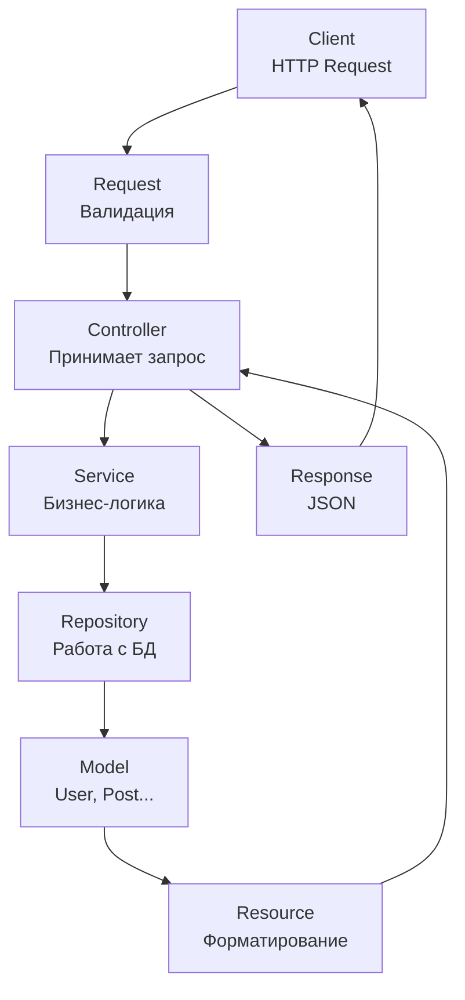

# Дипломный проект на Laravel 12

### Что можно доделать (улучшить):

1. Внедрение Repository & Service

```mermaid
flowchart TD
    A[Client\nHTTP Request] --> B[Request\nВалидация]
    B --> C[Controller\nПринимает запрос]
    C --> D[Service\nБизнес-логика]
    D --> E[Repository\nРабота с БД]
    E --> F[Model\nUser, Post...]
    F --> G[Resource\nФорматирование]
    G --> C
    C --> H[Response\nJSON]
    H --> A
```

2. Попробовать переименовать таблицы БД (car_...., user_..., order_...)

