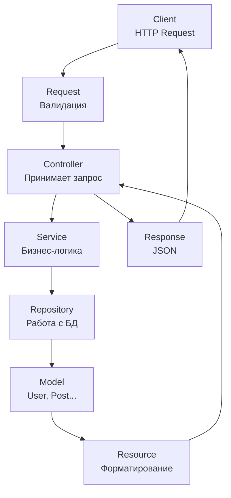

# Дипломный проект на Laravel 12

### Что можно доделать (улучшить):

1. Внедрение Repository & Service

2. Попробовать переименовать таблицы БД (car_...., user_..., order_...)

Как создать *новую ветку* локально, переключиться на неё, сделать коммит и запушить изменения на удалённый репозиторий (Remote) :
1. Создайте *новую ветку* `git branch имя_ветки`
2. Переключитесь на *новую ветку* `git checkout имя_ветки`
3. Внесите изменения в проект
4. Добавьте изменения к коммиту `git add .`
5. Сделать коммит `git commit -m "Изменения"`
6. Отправьте изменения на Remote `git push origin имя_ветки`

Слияние веток
1. Переключиться на главную ветку `git checkout main`
2. Обновите локальную ветку main (опционально, но рекомендуется) `git pull origin main`
3. Слейте *ветку* в main `git merge имя_ветки`
4. Удалите локальную *ветку* `git branch -d имя_ветки`
